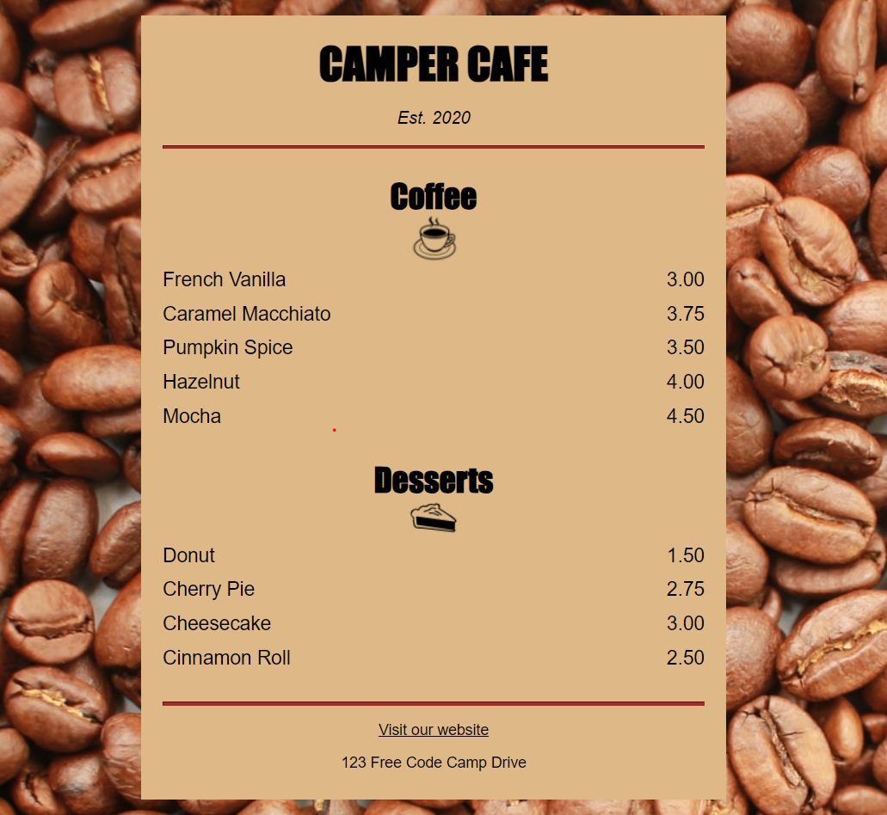

# Cafe Menu

This is a simple HTML project for a cafe menu. It displays the name of the cafe, the establishment year, and a section for coffee items.

## Preview



## Project Structure
* index.html: The main HTML file.
* styles.css: The CSS file for styling the HTML.

## Clone the repository:

   ```sh
   git clone [<repository-url>](https://github.com/Chol369/cafeMenu.git)
